# NAGEKI 3.33
A full size Ongeki controller
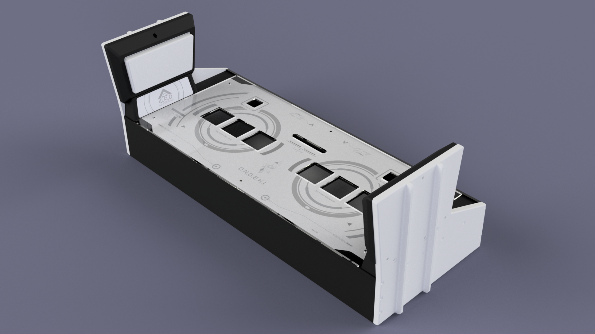
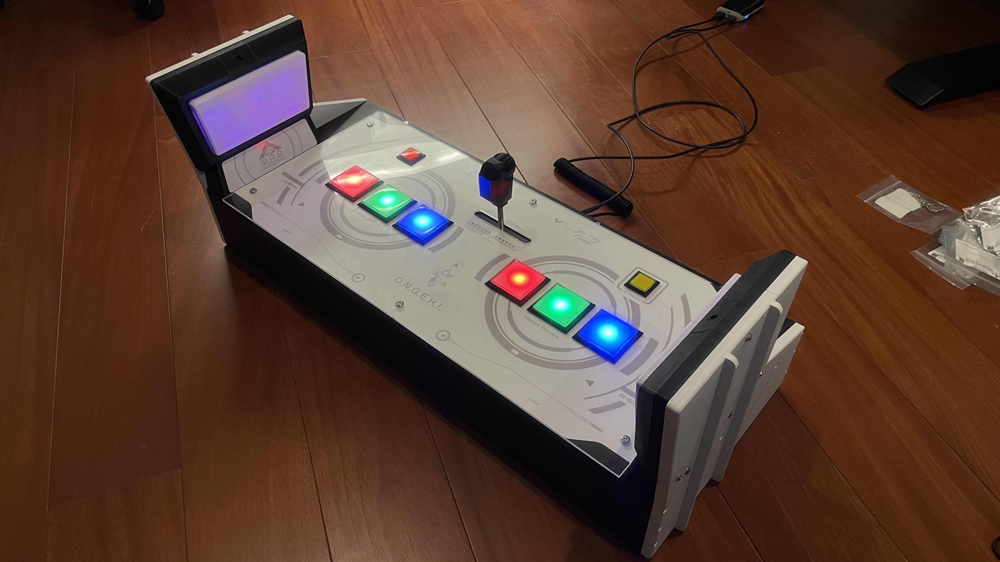

# General Requirements
 - Access to 3d printer
 - Soldering tool
 - x4~5 PLA filament, the brand I used is eSUN PLA+
 - 22~26 AWG wires
 - Crimping tool
 - Access to laser cutter & poster printer & sticker printer
 - Some CAD knowledge
 - Some arduino coding knowledge
 - Ability to DIY stuff up if things doesn't go your way

# Additional resources
-  [Rhythm Cons Wiki](https://rhythm-cons.wiki/w/Main_Page)
-  [Cons&Stuff Discord](https://discord.com/invite/fknwz8s) - ping me @Zekamashi#7734 if you're struggling; some resources required are also pinned in `#ongeki` channel in this server

# Table of Contents
1. [Lever](#lever)
2. [WAD](#wad)
3. [Case](#case)
4. [Buttons and PCB](#buttons-and-pcb)
5. [Graphics](#graphics)
6. [Firmwares](#firmwares)

## Lever
### Toxikmango
#### Parts required
| Part                                                                     | Qty |
|--------------------------------------------------------------------------|-----|
| Everything listed in https://github.com/toxikmango/Ongeki-Lever*         |     |
| x2 M8 or 5/16" threaded bolts(75mm) and nuts                             | 2   |
| silicone tube for threaded bolts, OD ~12                                 | 2   |
  - *PandAuto pot can be substituted for cheap potentiometer, the one I used is B10k
  - *Fully threaded bolts can be either hex bolt or studded

#### Print settings
15-20% infill, 2 infill line multiplier, 3 wall line count, 0.20-0.28mm layer height

#### Assembly
1. Print out the `base with stoppers.stl` from `/LEVER/toximango/` in this repo. Lever assembly for studded bolt is straightforward, just thread it into `lever.stl` from the original repo.
If you're using hex threaded bolt then print out the `lever big.stl` and `long nut.stl` instead. Then thread long nut into the end of the bolt, wrap some teflon tape around it and jam it into the `lever big.stl`.
Might want to add nylock and a nut on where the bottom of the knob would go, but don't put on the knob itself yet, we will do it after mounting everything into the case.

2. Mount potentiometer into the base. If your pot have a "tooth" on it then use soldering iron to melt down small hole into the base so that your pot can mount flat on the surface.
Use a socket wrench to help tighten it in place

3. Now for the shaft assembly, start by inserting the tension chuck, 2 nuts (one goes into the bottom the chuck, another just to position the bearing) and bearing into the threaded bolt
    - Sanding tension chuck down to one grid is also recommended
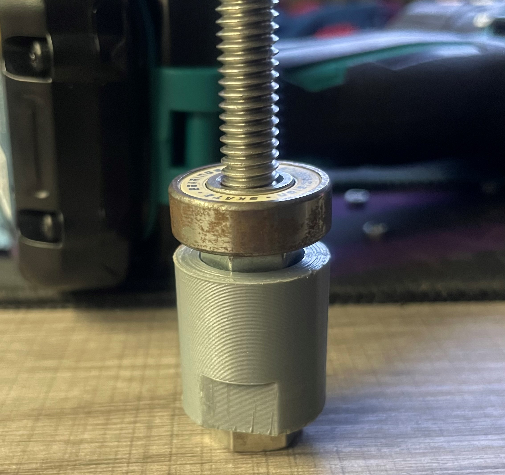
4. Check that the chuck lines up with the clamp    
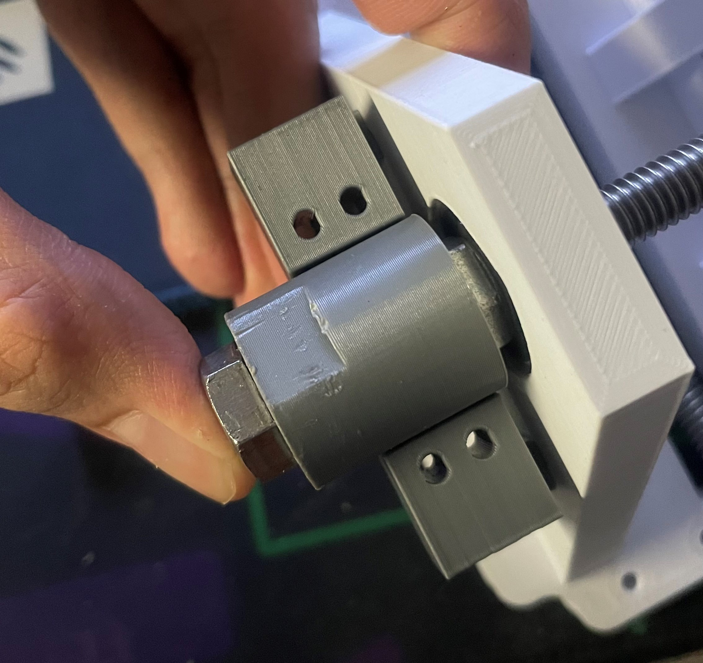
Add nylock and another nut
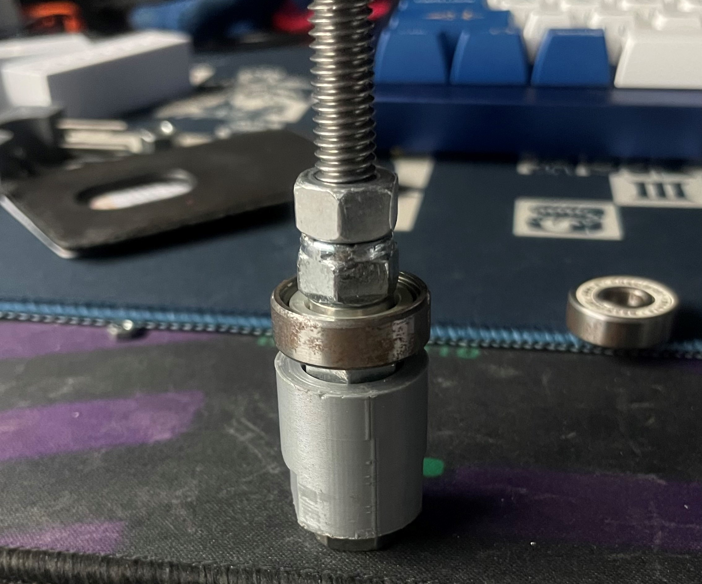
Insert the end of the bolt into the base, then add lever, nylock, nut and bearing in respectively   
The order right now should be:    
[Hex bolt]---[Nut]---[Nut]---[Bearing]---[Nylock]---[Nut]---[Lever]---[Nylock]---[Nut]---[Bearing]--->
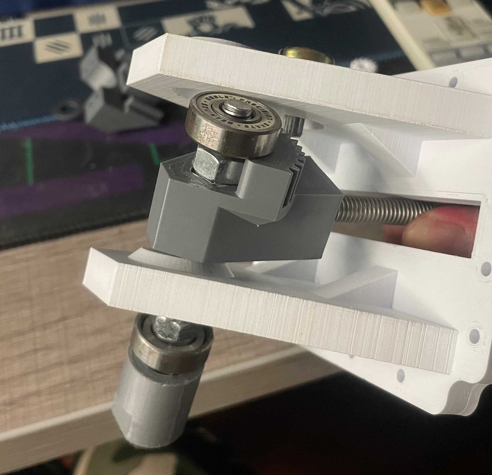
Start torquing everything into place.    
Spur gear for the potentiometer should be added around this point. If your pot shaft is star-shaped then use ` Spur Gear (12 teeth) knurled.stl` from this repo instead.
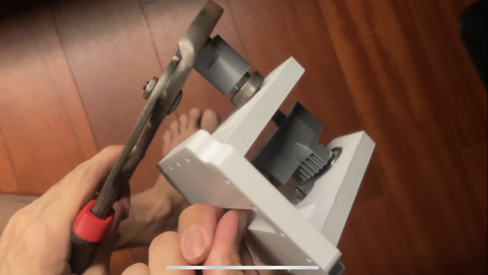
5. Stop torquing when the lever stays on the exact center of the base. Tightens the nut at the back of the lever into it.    
It's highly recommended to cover the end of the shaft with a washer and a nylock too, to lock it in place and keep it from slipping off
6. Add both clamps into the assembly. Again, you might want to sand the clamp surface down for smoother lever.
### Abi
Files are pinned in `#ongeki` channel in Cons&Stuff server    
I did not use this lever design on my controller because the materials are too difficult to source, 
but I did upload my own f3d design for coil coupler so that it would fit in controller case, and you can mess 
with the setting to have its diameter match your coil. 

## WAD
### Parts required
| Part                                                                                 | Qty |
|--------------------------------------------------------------------------------------|-----|
| 100g button springs (the same ones used on main/sdvx buttons)                        | 2   |
| M3 flange nut                                                                        | 2   |
| M3 spring washer                                                                     | 2   |
| M4x20~25mm screws                                                                    | 3   |
| M4 flange nut                                                                        | 3   |
| IR Optocoupler + breakout board (the sensor mount I made is designed to fit ITR9608) | 1   |
| WS2812b + something to mount the cables on                                           | 6   |

### Print settings
- 10% infill, 1 infill line multiplier, 2 wall line count, 0.20 layer height for button face
- 12% infill, 1 infill line multiplier, 3 wall line count, 0.20 layer height for the rest

### Assembly
Wire up and mount everything as shown in picture below. If your sensor is not ITR9608 or has different dimension then you might want to model up a
different 30x20mm mount.    
I made mount models with different heights to test out button sensitivity. The one I find most accurate is 6mm mount. 
Feel free to experiment with these heights but according to many source, the button should feel the same as maimai button which is VERY sensitive and activates by just wiggling.    
You can also add some keyboard tape/thin foam on where the button would make contact with the shield for longevity.
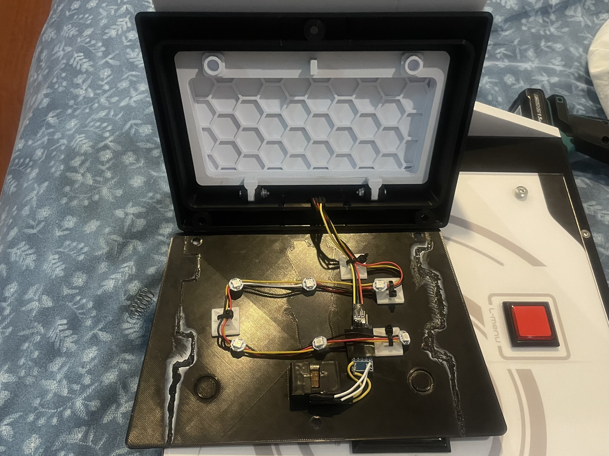

## Case
### Parts required
| Part                        | Qty |
|-----------------------------|-----|
| M5*20 mm screws             | 12  |
| M5 nut                      | 12  |
| M4*20 mm countersunk screws | ~30 |
| M3*20 mm countersunk screws | ~16 |
| M3*10 mm screws             | ~16 |
| M3*5 mm countersunk screws  | 24  |
| M3 Nut/ flange nut          | ~16 |
| M3 Nut                      | 24  |
| Epoxy glue                  | 80g |
| Cabinet magnet              | 10  |
| Big rubber adhesive feet    | ~8  |
### Print settings
- 12% infill, 1 infill line multiplier, 3 wall line count, 0.28 layer height

### Assembly
1. Glue up each side parts with epoxy glue, don't forget to sand down with 80 grit sandpaper before applying glue to make the bond stronger. 
Get the bottom part laser cut with 2mm acrylic instead if you want to save sanity.    
2. You should now have 7 big parts; top, wad(left), wad(right), side(north), side(south), bottom. 
Everything except bottom part can be screwed together with self threading hole. Then mount cabinet magnet onto the bottom part.     
3. Loosely mount side button and run cable down into the hole. Glue M5 nut on the WAD cover hole and mount it over side button. 
Make sure the side button backplate doesn't get caught in between and start righting the screws    
4. Mount lever assembly under the case then insert the knob. Use teflon tape to make the knob tight-fit and start smacking it into place 
(hold the bottom of the lever while doing so, be careful damaging/breaking the top side!). 
Make sure that the countersunk screws is flush with the surface to prepare for acrylic cover.

### Notes
- I also include .dxf files for each side in case you want to get MDF cut instead (not tested)
- Epoxy glue smells awful. Do this either outdoor or in a well ventilated room

## Graphics
| Part                    | Qty |
|-------------------------|-----|
| M5x20 Round flat screws | 6   |
| M5 flange Nut           | 6   |
### Assembly
#### Acrylic cover:   
- Laser cut with 4mm clear acrylic

#### Cover graphic:
- Print it with printing service of your choice, for mine, I ink-jetted it on PP paper
- Put your acrylic over on top of it and use a pen to trace all the holes
- Cut every hole out with a knife
- Neardayo's Faucetwo customization video to get a better picture: https://www.youtube.com/watch?v=mpwCRY_63XE
- Put the printed paper on top of your case, cover it with acrylic and screw it down. Do not tighten it too hard or the acrylic will crack

#### WAD Decal:
- Print it on vinyl sticker (I went to an Itasha shop to get mine)
- Before applying sticker don't forget to sand the surface where it would go down to 1000 grit

### Notes
- You may notice that the top of cover & graphic is 1cm shorter than the case. This is because lots of shop I went to check can only print 30cm wide. 
Feel free to add 1 cm to the top if your printing service is capable of wider print
- For top cover you can do reverse UV print instead if you want to go extra
- Once the cover is mounted onto the case you may find the WAD cover impossible to remove without having to take the cover off first. 
You can get around by sliding left/right to access side button screws to remove the side button first, then the WAD cover

## Buttons and PCB
### Parts required
| Part                      | Qty |
|---------------------------|-----|
| 60*60 mm square buttons\* | 6   |
| 33*33 mm square buttons   | 2   |
| WS2812b                   | 6   |
| Arduino Pro Micro         | 1   |
| 6 pin JST XH              | 8   |
| 4 pin JST XH              | 4   |
| 3 pin JST XH              | 1   |
| 2 pin JST XH              | 2   |
| M3x10mm screws            | 4   |
- *if you're using Sanwa make sure lamp holder is the old style

### Assembly
[Use this](https://www.thingiverse.com/thing:2204192) to mount WS2812b to your 60*60 buttons, use teflon tape to make everything fit snugly. 
Order the pcb from [JLCPCB](https://jlcpcb.com/) or any pcb printing service of your choice.
Route connect the first WS2812b DIN to A1 and DOUT to L1OUT, then connect the next WS2812b DIN to L1OUT and DOUT to L2OUT etc. etc.    
Slide the PCB to 3d printed enclosure, secure it with screws and use double side tape to mount it under the case.
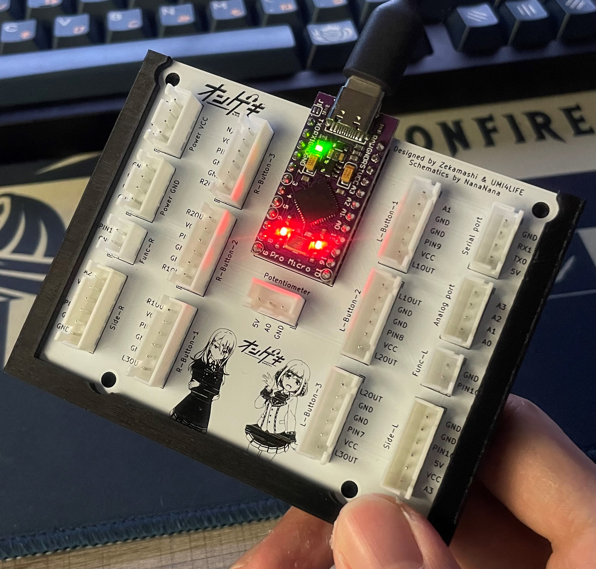
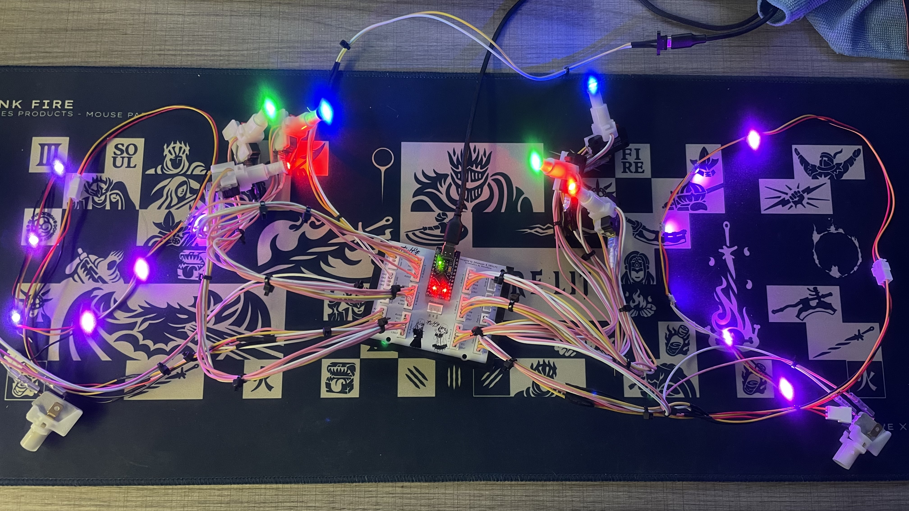
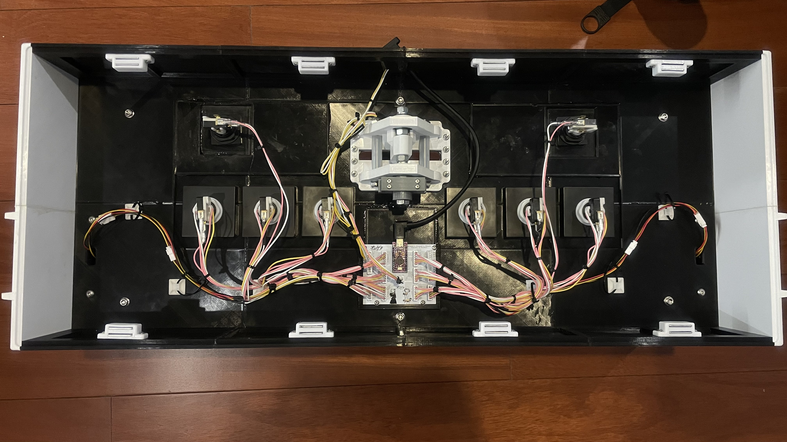

## Firmwares
There are 3 firmwares that I recommend
- [skogaby/OngekiCon.ino](https://gist.github.com/skogaby/59331321ba9427996ff1c941a32b05f4) - uses XInput, needs to short RST pin to GND pin everytime you want to re-upload code
- [ongeki-io](https://github.com/Nana0Nana/ongeki-io) - has hid lighting, looks fancy on song selection
- [mouse&keyboard](https://github.com/Nana0Nana/NAGEKI/blob/main/nageki2.0%20code/nageki2.0.ino) - use this if you want to play MuDrive

For all of these code I suggest you include `ResponsiveAnalogRead` library to get smoother lever reading.
```
...
#include <ResponsiveAnalogRead.h>
...
ResponsiveAnalogRead analog({{LEVER_PIN}}, true);
...
```

Make sure the code follows PCB's pin in/out    

| Component              | Pin |
|------------------------|-----|
| Left button 1          | 9   |
| Left button 2          | 8   |
| Left button 3          | 7   |
| Right button 1         | 6   |
| Right button 2         | 5   |
| Right button 3         | 4   |
| Left Menu              | 15  |
| Right Menu             | 10  |
| Lever                  | A0  |
| Main buttons LEDs      | A1  |
| Left side button LEDs  | A2  |
| Right side button LEDs | A3  |

Your photo interrupter's breakout board may have unobstructed=HIGH configuration.
In this case you will need to invert side buttons' logic.

# Closing Notes
- To test how well it plays (especially the wads), try エータ・ベータ・イータ on master difficulty
- Main buttons spacing are 1mm off from official spec. You are inhuman if you notice the difference between this and official panel
- Do not use this controller to stream "that" on GDQ